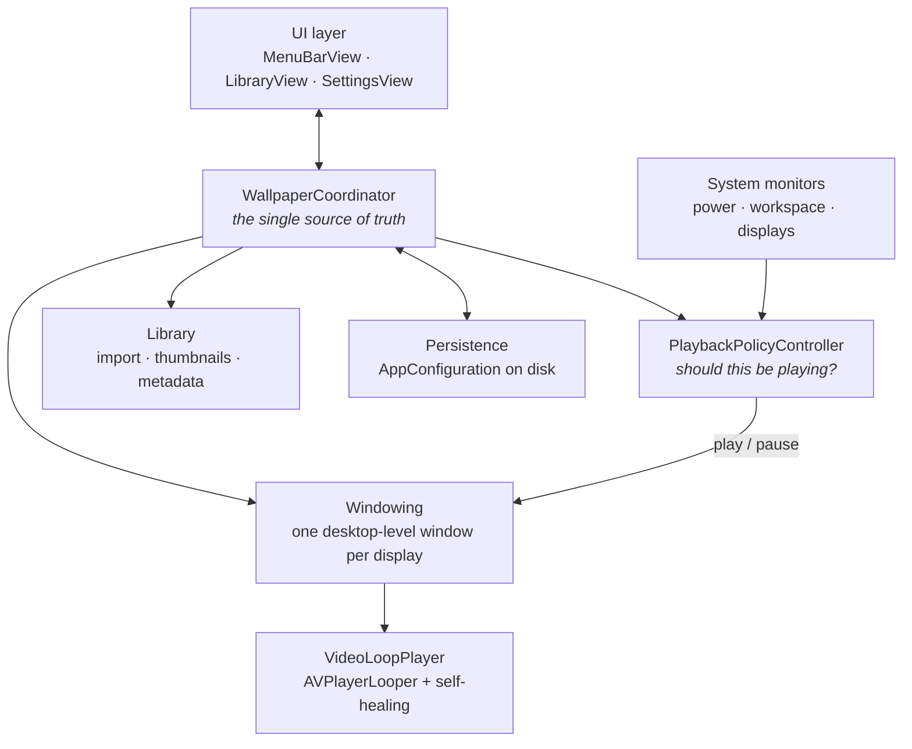

<div align="center">

<picture>
  <source media="(prefers-color-scheme: dark)" srcset="assets/logo-dark.png">
  
</picture>

<h1>Wallpache</h1>

<p><strong>Live video wallpapers for macOS.</strong></p>

<p>
Import an <code>.mp4</code>, <code>.mov</code>, or <code>.m4v</code> and it loops behind your desktop icons —<br>
per display, at the scale you choose, paused whenever your Mac needs the battery.
</p>

<p>


</p>

<sub>It lives in the menu bar. Clicks pass straight through to the desktop, and the video never keeps your display awake.</sub>

</div>

---

## Contents

- [Requirements](#requirements)
- [Install](#install)
- [First run](#first-run)
- [Why macOS says the app is "damaged"](#why-macos-says-the-app-is-damaged)
- [Using Wallpache](#using-wallpache)
- [Where your files go](#where-your-files-go)
- [Project design](#project-design)
- [Building from source](#building-from-source)
- [Releasing](#releasing)
- [Distribution model](#distribution-model)

---

## Requirements

| | |
|---|---|
| macOS | 13.0 Ventura or later |
| Architecture | Universal — Apple Silicon and Intel |
| Video formats | `.mp4`, `.mov`, `.m4v` |
| To build | Xcode 16.3 or later |

---

## Install

> Installs come from the public release repo, `wallpache-dist` — never from this
> one. See [Distribution model](#distribution-model).

### Option 1 — One-line installer (recommended)

Paste this into Terminal:

```bash
curl -fsSL https://raw.githubusercontent.com/Anuboost-Long/wallpache-dist/main/install.sh | bash
```

It downloads the latest release, verifies the download, installs to
`/Applications`, and clears the quarantine flag so macOS opens it without
complaint. Then:

```bash
open -a Wallpache
```

To install somewhere else, set `INSTALL_DIR`:

```bash
INSTALL_DIR="$HOME/Applications" bash -c "$(curl -fsSL https://raw.githubusercontent.com/Anuboost-Long/wallpache-dist/main/install.sh)"
```

### Option 2 — Download the disk image

1. Go to [Releases](https://github.com/Anuboost-Long/wallpache-dist/releases) and
   download `Wallpache.dmg`.
2. Open it and drag **Wallpache** onto the **Applications** shortcut.
3. Clear the quarantine flag, or macOS will refuse to open it:

   ```bash
   xattr -dr com.apple.quarantine /Applications/Wallpache.app
   ```

4. Open it from Applications.

> Step 3 is not optional. See the next section for why.

### Option 3 — Build it yourself

Nothing you compile locally is quarantined, so this route skips the problem
entirely. See [Building from source](#building-from-source).

---

## First run

1. **Open Wallpache.** The library window opens by itself the first time. After
   that, reach it from the menu-bar icon.
2. **Add a video.** Drag an `.mp4`, `.mov`, or `.m4v` onto the window, or press
   **Import Video…**. The file is copied into Wallpache's own storage, so moving
   or deleting the original later doesn't break the wallpaper.
3. **Preview it** to check the loop before committing to it.
4. **Apply it** — **Apply** covers every display, or use the **Display** menu on
   the tile to set one screen at a time.
5. **Optional — launch at login.** Settings → Startup. macOS asks for approval
   the first time; if it's refused, the settings pane links straight to the right
   System Settings page.

---

## Why macOS says the app is "damaged"

If you downloaded a release and macOS says:

> "Wallpache" is damaged and can't be opened. You should move it to the Trash.

**The download is fine.** Nothing is corrupted.

Wallpache is signed *ad-hoc* rather than with a paid Apple Developer ID
certificate. macOS flags anything arriving from a browser with a quarantine
attribute, and for an ad-hoc signed app it reports that as damage rather than
offering the usual "unidentified developer" prompt. Clearing the flag is the fix:

```bash
xattr -dr com.apple.quarantine /Applications/Wallpache.app
```

The one-line installer does this for you, which is the main reason to prefer it.
Building from source avoids it too, because locally built apps are never
quarantined.

---

## Using Wallpache

**Per display.** Each screen keeps its own video, scaling mode, playback rate,
and mute setting.

**Scaling modes**

| Mode | Behaviour |
|---|---|
| `Fill` | Covers the screen, cropping the overflow |
| `Fit` | Whole frame visible, letterboxed |
| `Stretch` | Fills the screen, ignoring aspect ratio |
| `Center` | Native pixel size, centred |

**Energy saving.** Wallpache stops playback rather than burning battery on
frames nobody is looking at. Each of these is a toggle in Settings:

- Low Power Mode is on
- The Mac is under thermal pressure
- The screen is locked
- The Mac is asleep

The menu bar always shows the current state — *Paused in Low Power Mode*,
*Paused while the Mac is hot*, and so on — so a stopped wallpaper is never a
mystery.

---

## Where your files go

```
~/Library/Application Support/Wallpache/
├── videos/       imported copies of your videos
├── thumbnails/   library grid thumbnails
└── stills/       full-resolution preview frames
```

Settings → Storage has **Show in Finder** and **Delete All Imported Videos…**.
Removing a wallpaper returns that display to its normal macOS wallpaper.

Wallpache runs in the App Sandbox and asks for read-only access only to files
you pick yourself.

---

## Project design

### Repository layout

```
Wallpache/
├── apps/
│   ├── macos/       native macOS app (the shipping product)
│   ├── windows/     placeholder, not yet implemented
│   └── mobile/      placeholder, not yet implemented
├── shared/          branding, icons, schemas, sample videos
├── docs/            implementation notes
├── Scripts/         install and release tooling
└── dist/            build output (gitignored)
```

### How the macOS app fits together



### The pieces

| Module | Responsibility |
|---|---|
| `Core/WallpaperCoordinator` | Observable state the whole UI binds to; owns import, apply, delete, pause |
| `Core/PlaybackPolicyController` | Decides whether playback should run, and names the reason when it shouldn't |
| `Core/WallpaperSession` | One display's live wallpaper — window, player, and settings together |
| `Playback/VideoLoopPlayer` | Seamless looping on `AVPlayerLooper`, rebuilding itself after stalls, decoder errors, and sleep/wake |
| `Windowing/WallpaperWindow` | Borderless window pinned below the desktop icons, transparent to clicks |
| `Library/` | Importing, thumbnails, still frames, and video metadata |
| `Displays/` | Display discovery and per-display configuration |
| `System/` | Power, thermal, screen-lock, and login-item integration |
| `Persistence/` | Versioned `AppConfiguration`, decoded defensively so an old config never blocks launch |

### Design decisions worth knowing

**A wallpaper must never cost you anything.** The player sets
`preventsDisplaySleepDuringVideoPlayback = false`, the window refuses hit tests
so clicks reach the desktop, and playback stops the moment the policy controller
says it should.

**Playback is expected to fail sometimes.** Sleep/wake cycles, display changes,
and transient decoder errors all break `AVPlayer` in practice, so
`VideoLoopPlayer` observes its own health and rebuilds from the source URL, with
a capped retry budget that resets once playback proves healthy again.

**Imports are copies.** The library owns its files, so moving or deleting the
original video later can't break a running wallpaper.

**One coordinator, no scattered state.** Views hold no wallpaper state of their
own; everything flows through `WallpaperCoordinator`.

---

## Building from source

```bash
git clone https://github.com/Anuboost-Long/wallpache.git
cd wallpache
APP_ONLY=1 Scripts/make-dmg.sh
```

The app is written to `dist/Wallpache.app`. Copy it into `/Applications` and
open it — no quarantine, no Gatekeeper warning, because you built it.

To open the project in Xcode instead:

```bash
open apps/macos/Wallpache.xcodeproj
```

Xcode's signing settings carry a development team that won't match your account.
Either set your own under **Signing & Capabilities**, or use the script above,
which builds with an ad-hoc signature and no team at all.

Run the tests with:

```bash
xcodebuild -project apps/macos/Wallpache.xcodeproj -scheme Wallpache test
```

---

## Releasing

`Scripts/make-dmg.sh` builds a universal Release binary, strips the
`get-task-allow` entitlement that would make the app unlaunchable on other Macs,
re-signs, and packages a `.zip` and a `.dmg` into `dist/`.

```bash
Scripts/make-dmg.sh              # zip + dmg
APP_ONLY=1 Scripts/make-dmg.sh   # just the signed .app
```

It picks a signing identity on its own: a **Developer ID Application**
certificate if the keychain has one, otherwise an ad-hoc signature. To pin the
settings, copy `Scripts/signing.env.example` to `Scripts/signing.env` (which is
gitignored) and fill it in.

### Shipping without the "damaged" warning

That needs a paid Apple Developer Program membership:

1. Create a **Developer ID Application** certificate in Xcode → Settings →
   Accounts → Manage Certificates.
2. Store notary credentials once:

   ```bash
   xcrun notarytool store-credentials wallpache \
     --apple-id you@example.com --team-id TEAMID \
     --password <app-specific-password>
   ```

3. Set `NOTARIZE=1` in `Scripts/signing.env`.
4. Run `Scripts/make-dmg.sh`.

The script notarizes and staples the app *before* packaging, then notarizes the
disk image, so both the `.dmg` and the copy dragged out of it open cleanly —
including on a machine that is offline. The Gatekeeper line at the end prints
`accepted` when the build is genuinely shippable.

---

## Distribution model

Wallpache is not open source. The source lives here, in a **private** repo, and
users never see it — they install a compiled app from a second, **public** repo
that carries nothing but the installer and the release binaries.

| Repo | Visibility | Contents |
|---|---|---|
| `Anuboost-Long/wallpache` | private | all source and history — this repo |
| `Anuboost-Long/wallpache-dist` | public | `install.sh`, `README.md`, and release assets |

The split is not cosmetic. **GitHub release assets inherit the repository's
visibility**, so `releases/latest/download/…` on a private repo answers 404 to
anyone without a token. A public surface is required for the installer to work
at all, and the dist repo is the smallest one possible: a shell script that
downloads a zip, and a README. Neither reveals anything about the source.

### Setting up the dist repo, once

Create an empty public repo named `wallpache-dist`, then:

```bash
git clone https://github.com/Anuboost-Long/wallpache-dist.git
cd wallpache-dist
cp /path/to/wallpache/Scripts/install.sh .
cp /path/to/wallpache/dist-repo/README.md .
chmod +x install.sh
git add . && git commit -m "Installer and readme" && git push
```

`dist-repo/` in this repo holds the public README. `Scripts/install.sh` is
copied over verbatim — it already points at `wallpache-dist`, so it needs no
edits between the two repos.

### Publishing a release

1. `Scripts/make-dmg.sh`
2. Create a release on **`wallpache-dist`** — not on this repo.
3. Attach both `dist/Wallpache.zip` and `dist/Wallpache.dmg`.

The installer fetches `Wallpache.zip` from the latest release, so that exact
filename has to be attached or the one-liner breaks.

> Once source is pushed to a public repo it cannot be taken back — history,
> forks, and caches persist. Keep this repo private from the first push.
