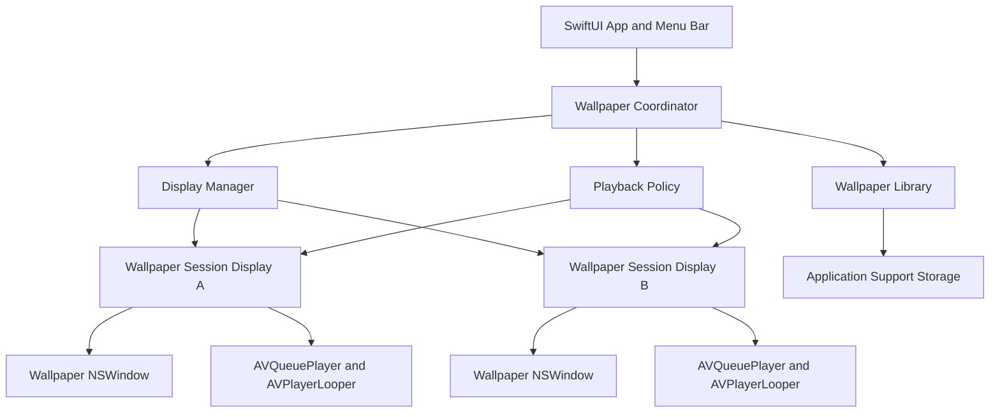

# Free macOS Live Wallpaper App
## Product Requirements and Implementation Theory

**Document status:** Initial technical plan
**Recommended platform:** macOS 13 or later
**Recommended stack:** Swift, SwiftUI, AppKit, AVFoundation
**Backend:** Not required for the initial product
**Primary goal:** Let users select a local video and display it as a continuously animated desktop wallpaper for free.

---

## 1. Product Summary

The application will behave like a lightweight live-wallpaper utility. It will not replace the macOS system wallpaper with an MP4 or MOV file. Instead, it will create a borderless, noninteractive window for each selected display, place that window at the desktop window level, and continuously play a muted video inside it.

The application should run primarily as a menu-bar utility and remain active while a live wallpaper is enabled.

### Core product promise

> Select a local video, choose a display and scaling mode, and use it as an animated desktop background without uploading the video anywhere.

### Initial product principles

- Free to use.
- Local-first and privacy-friendly.
- No account required.
- No backend required.
- No video upload.
- Low CPU, GPU, memory, and battery usage.
- Stable across sleep, wake, Spaces, display changes, and app relaunches.
- Native macOS behavior rather than an Electron-style browser shell.

---

## 2. Theory of Operation

### 2.1 What a live wallpaper app actually does

macOS does not provide a general public API that accepts an arbitrary MP4 or MOV file as the system desktop wallpaper.

The practical method is:

```text
Actual macOS static wallpaper
            ↓
Borderless video window owned by this app
            ↓
Finder desktop icons
            ↓
Normal application windows
```

The app creates an `NSWindow` and assigns it a Core Graphics desktop-related window level. The window:

- Has no title bar or controls.
- Covers the full display frame.
- Ignores all mouse events.
- Does not accept keyboard focus.
- Does not appear in normal window switching.
- Joins the required Spaces.
- Contains an `AVPlayerLayer`.
- Plays a muted video using `AVQueuePlayer` and `AVPlayerLooper`.

The result looks like a system live wallpaper even though it is technically a persistent desktop-level video window.

### 2.2 Why the video window must remain running

The animation belongs to the application process. When the app quits:

- The player stops.
- The wallpaper window closes.
- The normal macOS wallpaper underneath becomes visible.

Therefore, the application should run as a menu-bar accessory and optionally launch at login.

### 2.3 Why each monitor needs its own player session

Every connected display may have:

- A different resolution.
- A different aspect ratio.
- A different Retina scale.
- A different selected wallpaper.
- A different crop and playback preference.

The engine should therefore maintain one wallpaper window and player session per display.

```text
Display A → WallpaperWindow A → PlayerSession A → Video A
Display B → WallpaperWindow B → PlayerSession B → Video B
Display C → WallpaperWindow C → PlayerSession C → Video C
```

Using one window stretched across all monitors would make independent wallpapers, scaling, and monitor reconnection much harder.

---

## 3. Recommended Technology

| Area | Recommendation | Reason |
|---|---|---|
| Language | Swift | Direct access to macOS APIs |
| Main UI | SwiftUI | Fast settings and library UI development |
| Wallpaper engine | AppKit | Precise `NSWindow` control |
| Video playback | AVFoundation | Hardware-accelerated native playback |
| Looping | `AVQueuePlayer` + `AVPlayerLooper` | Cleaner continuous looping |
| Video rendering | `AVPlayerLayer` | Lightweight layer-based playback |
| Persistence | `UserDefaults` initially | Enough for settings and recent files |
| Expanded library | SwiftData later | Better for many wallpapers and metadata |
| Login startup | `SMAppService` | Native launch-at-login support |
| File selection | `NSOpenPanel` | User-controlled local file access |
| Distribution | Signed and notarized DMG first | Easier iteration than Mac App Store review |
| Backend | None for MVP | All work can happen locally |

### Why not Electron

Electron would run a browser engine in addition to the video playback process. For an app intended to remain open all day, native Swift should generally provide:

- Lower idle memory use.
- Better power behavior.
- Easier window-level control.
- Easier display and workspace integration.
- Simpler AVFoundation playback.
- Better Mac App Store compatibility.

### Why not a web application

A browser tab cannot reliably:

- Stay below desktop icons.
- Create one desktop-level window per monitor.
- restore itself as a wallpaper after login.
- manage Spaces and display reconnection like a native utility.
- remain active when the browser closes.

A web interface could be used for a future wallpaper catalogue, but the wallpaper engine itself should be native.

---

## 4. Product Scope

## 4.1 Minimum Viable Product

The first usable release should support:

1. Importing one local MP4 or MOV file.
2. Previewing the video.
3. Applying it to the primary display.
4. Muted, seamless looping.
5. Fill and Fit scaling modes.
6. Pause and Resume controls.
7. Stopping the live wallpaper.
8. Restoring the selected wallpaper after app relaunch.
9. Pausing before system sleep.
10. Resuming after system wake.
11. Optional launch at login.
12. A menu-bar interface.
13. No backend and no account.

## 4.2 Version 1 Requirements

After the single-display MVP is stable:

1. Detect all connected displays.
2. Apply one wallpaper to all displays.
3. Apply a different wallpaper to each display.
4. Handle monitor connection and disconnection.
5. Add Fill, Fit, Stretch, and Center modes.
6. Add playback speed selection.
7. Add optional audio control, defaulting to muted.
8. Pause during Low Power Mode.
9. Pause at serious or critical thermal states.
10. Add recent wallpaper history.
11. Add a local wallpaper library.
12. Support drag and drop.
13. Show estimated energy impact guidance.
14. Add automatic playback recovery after Finder or display configuration changes.

## 4.3 Later Enhancements

- Playlist rotation.
- Schedule wallpapers by time of day.
- Different wallpapers by Space.
- Pause when another app enters full screen.
- Pause when running on battery.
- Pause when a selected high-performance app is running.
- Animated screensaver companion.
- Static fallback frame generation.
- Video trimming and cropping.
- HEVC optimization.
- Built-in free wallpaper catalogue.
- Community submissions.
- Cloud synchronization.

The later catalogue and community features may require a backend. Local wallpapers do not.

---

## 5. Functional Requirements

## 5.1 Application Shell

The app should normally run as a menu-bar utility.

### Menu-bar actions

- Open Wallpaper Library.
- Import Video.
- Apply Wallpaper.
- Pause.
- Resume.
- Stop.
- Select Display.
- Launch at Login toggle.
- Energy Saving toggle.
- Settings.
- Quit.

Recommended application activation policy:

```swift
NSApplication.shared.setActivationPolicy(.accessory)
```

This keeps the app out of the Dock during normal wallpaper operation. The app may temporarily show a standard settings window when requested.

## 5.2 Video Import

The user selects a local file through `NSOpenPanel`.

### Initial accepted formats

- `.mp4`
- `.mov`
- `.m4v`

The app should verify the file with `AVURLAsset` before applying it.

Validation should check:

- Asset is playable.
- Asset contains a video track.
- Duration is greater than zero.
- File still exists.
- Video is not protected by unsupported DRM.
- Codec is playable by AVFoundation on the current Mac.

### Storage strategy

For the MVP, copy imported wallpapers to:

```text
~/Library/Application Support/<AppName>/Wallpapers/
```

For a sandboxed build, this resolves inside the application container.

Copying the file into application-controlled storage simplifies:

- Persistent access.
- Missing-file handling.
- External-drive removal.
- Security-scoped bookmark management.
- Library cleanup.

An optional “Reference original file” mode can be added later using security-scoped bookmarks.

## 5.3 Wallpaper Window

Each wallpaper window must:

- Use `.borderless` style.
- Match the target screen's full `frame`.
- Be opaque.
- Have no shadow.
- Ignore mouse events.
- Reject key-window and main-window status.
- Avoid appearing in Command-Tab and normal window cycling.
- Stay stationary across Spaces.
- Join the required Spaces.
- Use a desktop-related window level.
- Remain retained while playback is active.

Suggested behavior:

```swift
window.collectionBehavior = [
    .canJoinAllSpaces,
    .stationary,
    .ignoresCycle
]
```

The exact behavior should be tested with Mission Control, Stage Manager, full-screen applications, and “Show Desktop.” Some combinations may differ between macOS versions.

### Recommended custom window subclass

```swift
final class WallpaperWindow: NSWindow {
    override var canBecomeKey: Bool { false }
    override var canBecomeMain: Bool { false }
}
```

### Window level theory

Start by testing:

```swift
let desktopLevel = CGWindowLevelForKey(.desktopWindow)
window.level = NSWindow.Level(rawValue: Int(desktopLevel) + 1)
```

The objective is to place the video above the normal desktop background while keeping Finder desktop icons usable above it.

Do not assume this behaves identically on every macOS release. Keep the level calculation isolated in one service so it can be changed without rewriting the engine.

## 5.4 Video Playback

Recommended playback stack:

```text
AVURLAsset
    ↓
AVPlayerItem
    ↓
AVQueuePlayer
    ↓
AVPlayerLooper
    ↓
AVPlayerLayer
```

Core requirements:

- Start automatically after applying.
- Default to muted.
- Loop continuously.
- Use hardware decoding when available.
- Avoid replacing the player item manually at every loop.
- Expose Play, Pause, Stop, Rate, and Mute operations.
- Observe playback failure and recover where possible.

Suggested rendering view:

```swift
final class WallpaperPlayerView: NSView {
    private let playerLayer = AVPlayerLayer()

    override init(frame frameRect: NSRect) {
        super.init(frame: frameRect)
        wantsLayer = true
        layer = playerLayer
        playerLayer.backgroundColor = NSColor.black.cgColor
    }

    required init?(coder: NSCoder) {
        fatalError("init(coder:) has not been implemented")
    }

    override func layout() {
        super.layout()
        playerLayer.frame = bounds
    }

    func setPlayer(_ player: AVPlayer) {
        playerLayer.player = player
    }
}
```

## 5.5 Scaling Modes

Map application options to `AVLayerVideoGravity` where possible.

| App option | Behavior |
|---|---|
| Fill | Preserve aspect ratio and crop overflow |
| Fit | Preserve aspect ratio and show the whole video |
| Stretch | Fill the display without preserving aspect ratio |
| Center | Keep natural size and center against a background |

Likely mappings:

```swift
.resizeAspectFill
.resizeAspect
.resize
```

Center mode may require a custom layout container rather than only changing `videoGravity`.

## 5.6 Multi-Display Management

Use `NSScreen.screens` to enumerate active displays.

Create a stable application display identifier from the screen’s display number:

```swift
let screenNumber = screen.deviceDescription[
    NSDeviceDescriptionKey("NSScreenNumber")
] as? NSNumber
```

Do not persist array indexes such as `screens[0]`, because display ordering can change.

Store:

```swift
struct DisplayWallpaperConfiguration: Codable {
    let displayID: UInt32
    var wallpaperID: UUID?
    var scalingMode: ScalingMode
    var playbackRate: Float
    var isMuted: Bool
}
```

### Display reconfiguration behavior

When screens change:

1. Read the new `NSScreen.screens` collection.
2. Compare it with active player sessions.
3. Close sessions for removed displays.
4. Create sessions for newly connected displays.
5. Reposition sessions whose frame changed.
6. Reapply saved configuration by stable display ID.
7. Fall back to the default wallpaper when no saved match exists.

The engine should debounce display-change events because docking and undocking may produce several notifications close together.

## 5.7 Sleep, Wake, Lock, and Power

Observe workspace sleep and wake notifications.

Expected behavior:

```text
System will sleep → Pause all players
System wakes      → Revalidate screens → Resume eligible players
```

Also consider:

- Screen lock.
- Screen unlock.
- Display sleep.
- User session switching.
- MacBook lid close and reopen.
- External display docking and undocking.

### Energy-saving policy

Recommended default rules:

- Pause before system sleep.
- Resume after wake.
- Pause during Low Power Mode when the user enables Energy Saving.
- Pause at serious or critical thermal state.
- Keep muted by default.
- Avoid decoding hidden or disconnected displays.
- Avoid 4K playback on a display where a lower-resolution optimized copy is sufficient.

Expose clear user options instead of silently changing behavior.

## 5.8 Launch at Login

For macOS 13 or later, use:

```swift
SMAppService.mainApp.register()
```

The app should:

- Display current authorization status.
- Handle user denial gracefully.
- Allow unregistering.
- Explain that macOS may require approval in System Settings.
- Restore the last wallpaper only after the application is fully initialized.

## 5.9 Persistence

MVP settings can use a Codable object stored in `UserDefaults`.

Persist:

- Current wallpaper.
- Wallpaper library items.
- Display assignments.
- Scaling mode.
- Playback rate.
- Muted state.
- Energy-saving preferences.
- Launch-at-login preference.
- Whether playback was active before the app quit.

Do not persist transient AVFoundation objects or `NSScreen` references.

Example model:

```swift
struct WallpaperRecord: Codable, Identifiable {
    let id: UUID
    var name: String
    var localRelativePath: String
    var dateImported: Date
    var duration: Double
    var width: Int?
    var height: Int?
    var previewImageRelativePath: String?
}
```

---

## 6. Proposed Architecture



## 6.1 Main Components

### `WallpaperCoordinator`

Central orchestrator responsible for:

- Applying wallpaper configurations.
- Starting and stopping sessions.
- Restoring saved state.
- Coordinating display and power events.
- Exposing state to SwiftUI.

### `WallpaperSession`

Owns exactly one:

- Display ID.
- `WallpaperWindowController`.
- `AVQueuePlayer`.
- `AVPlayerLooper`.
- Playback state.
- Current scaling mode.
- Current file URL.

### `DisplayManager`

Responsible for:

- Enumerating displays.
- Resolving stable IDs.
- Observing display changes.
- Mapping saved configurations to active screens.

### `WallpaperLibraryService`

Responsible for:

- Importing files.
- Copying files into app storage.
- Removing files.
- Extracting metadata.
- Generating preview thumbnails.
- Detecting missing or invalid files.

### `PlaybackPolicyController`

Determines whether playback should run based on:

- User pause state.
- Sleep and wake state.
- Low Power Mode.
- Thermal state.
- Screen lock.
- Optional full-screen application policy.

The policy should calculate one final decision:

```text
shouldPlay =
    wallpaperEnabled
    AND userDidNotPause
    AND systemIsAwake
    AND displayIsAvailable
    AND energyPolicyAllowsPlayback
```

### `LoginItemService`

Wraps `SMAppService` so Service Management code does not spread across the UI.

### `SettingsStore`

Loads and saves Codable configuration.

---

## 7. Suggested Project Structure

```text
LiveWallpaper/
├── App/
│   ├── LiveWallpaperApp.swift
│   ├── AppDelegate.swift
│   └── AppState.swift
├── Core/
│   ├── WallpaperCoordinator.swift
│   ├── WallpaperSession.swift
│   └── PlaybackPolicyController.swift
├── Windowing/
│   ├── WallpaperWindow.swift
│   ├── WallpaperWindowController.swift
│   └── WallpaperPlayerView.swift
├── Displays/
│   ├── DisplayManager.swift
│   ├── DisplayDescriptor.swift
│   └── DisplayWallpaperConfiguration.swift
├── Playback/
│   ├── VideoPlayerFactory.swift
│   ├── PlaybackState.swift
│   └── ScalingMode.swift
├── Library/
│   ├── WallpaperRecord.swift
│   ├── WallpaperLibraryService.swift
│   ├── VideoMetadataReader.swift
│   └── ThumbnailGenerator.swift
├── System/
│   ├── WorkspaceMonitor.swift
│   ├── PowerMonitor.swift
│   ├── LoginItemService.swift
│   └── FileAccessService.swift
├── Persistence/
│   ├── SettingsStore.swift
│   └── AppConfiguration.swift
├── UI/
│   ├── MenuBarView.swift
│   ├── LibraryView.swift
│   ├── ImportView.swift
│   ├── DisplayConfigurationView.swift
│   ├── SettingsView.swift
│   └── Components/
└── Resources/
    ├── Assets.xcassets
    └── SampleWallpapers/
```

---

## 8. Implementation Roadmap

## Phase 0 — Technical Proof of Concept

**Objective:** Prove that a desktop-level video window works reliably.

Tasks:

- Create a borderless `NSWindow`.
- Place it at the desktop window level.
- Make it ignore mouse events.
- Render one bundled video with `AVPlayerLayer`.
- Loop using `AVPlayerLooper`.
- Verify Finder desktop icons remain clickable.
- Test changing Spaces.
- Test Mission Control.
- Test Show Desktop.
- Test one full-screen application.
- Test app termination.

**Exit condition:** A bundled video plays behind desktop icons for at least one hour without interruption or increasing memory use.

## Phase 1 — Single-Display MVP

Tasks:

- Add SwiftUI menu-bar interface.
- Add `NSOpenPanel` import.
- Validate MP4, MOV, and M4V files.
- Copy imported videos into Application Support.
- Add preview.
- Add Apply, Pause, Resume, and Stop.
- Add Fill and Fit.
- Persist the selected wallpaper.
- Restore after relaunch.
- Add sleep and wake handling.
- Add basic error messages.
- Add logs for playback failures.

**Exit condition:** A nontechnical user can import and apply a wallpaper without Xcode or Terminal.

## Phase 2 — Reliability

Tasks:

- Handle invalid and deleted files.
- Recover from playback stalls.
- Recreate the player after wake when needed.
- Reorder the wallpaper window if its desktop position is lost.
- Handle Finder restart.
- Debounce display-change events.
- Add thermal-state behavior.
- Add Low Power Mode behavior.
- Measure idle memory, CPU, and energy use.
- Add crash recovery.

**Exit condition:** The app survives repeated sleep/wake and Space switching during a normal workday.

## Phase 3 — Multiple Displays

Tasks:

- Introduce stable display IDs.
- Create one session per display.
- Add per-display assignment.
- Add apply-to-all.
- Detect monitor connection and removal.
- Handle display resolution changes.
- Restore display-specific settings.
- Test mixed Retina and non-Retina displays.
- Test vertical monitors.

**Exit condition:** External monitors can be connected and removed without requiring an app restart.

## Phase 4 — Product Polish

Tasks:

- Add local wallpaper library.
- Add drag and drop.
- Generate thumbnails.
- Add playback speed.
- Add Stretch and Center.
- Add launch at login.
- Add onboarding.
- Add settings explanations.
- Add automatic updates if distributed outside the Mac App Store.
- Add privacy policy.
- Add open-source notices.
- Improve accessibility and keyboard navigation.

## Phase 5 — Distribution

Tasks:

- Choose app name and bundle identifier.
- Configure signing.
- Enable hardened runtime.
- Notarize releases.
- Produce a DMG.
- Add a GitHub release workflow.
- Test on a clean Mac user account.
- Test macOS upgrades.
- Decide whether to submit to the Mac App Store.

---

## 9. Nonfunctional Requirements

## 9.1 Performance

Target measurements for one 1080p H.264 wallpaper:

- Stable memory usage over long sessions.
- No continuous memory growth after loops.
- Low idle CPU when the frame is static or playback is paused.
- Hardware decoding where supported.
- No unnecessary thumbnail generation during playback.
- No duplicate player sessions for the same display.
- Immediate release of players for disconnected displays.

Avoid promising a fixed CPU percentage because results depend on:

- Video codec.
- Resolution.
- Frame rate.
- Number of monitors.
- Mac model.
- Other system load.

## 9.2 Privacy

- Do not upload user videos.
- Do not require an account.
- Do not collect filenames or file contents.
- Keep analytics optional or omit analytics entirely.
- Explain file storage location.
- Provide a “Delete imported files” action.

## 9.3 Reliability

- The wallpaper should not block desktop input.
- The app should never trap keyboard focus.
- Playback failure should fall back to the normal system wallpaper.
- Corrupt files should not crash the app.
- Missing displays should not invalidate other display configurations.
- Sleep and wake events should be idempotent.
- Applying the same wallpaper twice should not create duplicate windows.

## 9.4 Accessibility

- Full keyboard navigation in settings.
- VoiceOver labels.
- Reduced Motion notice.
- Clear pause control.
- High-contrast-friendly UI.
- Do not force animation in the settings preview when Reduced Motion is enabled unless the user starts it.

---

## 10. Important Edge Cases

Test all of the following:

### Window management

- Mission Control.
- Show Desktop.
- Stage Manager on and off.
- Multiple Spaces.
- Switching Spaces rapidly.
- Full-screen Safari or video player.
- Finder relaunch.
- User changes the normal macOS wallpaper.
- App settings window opens above wallpaper correctly.

### Displays

- MacBook display only.
- One external display.
- Two external displays.
- Display connected while app is running.
- Display removed during playback.
- Mirrored displays.
- Different refresh rates.
- Different Retina scales.
- Vertical display rotation.
- Resolution change.
- Laptop lid closed with external monitor.

### Playback

- Very short loop.
- Very long video.
- Variable-frame-rate video.
- H.264.
- HEVC.
- Video without audio.
- Video with audio.
- Missing video track.
- Corrupt file.
- File removed manually.
- External-drive source disconnected.
- App paused at the exact moment a loop boundary occurs.

### Lifecycle

- Sleep and wake repeatedly.
- Lock and unlock.
- Fast user switching.
- App launched at login.
- App force-quit.
- System shutdown while wallpaper is active.
- macOS update and reboot.

---

## 11. Risks and Mitigations

| Risk | Impact | Mitigation |
|---|---|---|
| Desktop window behavior changes between macOS versions | Wallpaper may appear above icons or disappear | Isolate window-level logic, maintain OS-specific tests |
| Stage Manager or full-screen Spaces behave differently | Inconsistent visibility | Test collection behaviors and document intended behavior |
| High-resolution video consumes battery | Poor user experience | Energy mode, resolution guidance, pause on battery |
| Invalid codec | Video cannot play | Validate `AVURLAsset`, show clear error, optionally transcode later |
| External source file disappears | Wallpaper stops | Copy imports to app storage |
| Player stalls after wake | Frozen wallpaper | Revalidate and recreate player session after wake |
| Multiple monitors increase resource use | Higher CPU/GPU | One optimized session per display, pause unavailable displays |
| Mac App Store sandbox restricts file access | Import or persistence problems | Use `NSOpenPanel`, app container copies, or security-scoped bookmarks |
| Copyright issues in bundled catalogue | Legal exposure | Bundle only owned, licensed, or public-domain assets |
| Seam is visible at the loop boundary | Low-quality appearance | Encourage loop-ready videos; later add trimming and crossfade tools |

---

## 12. Testing Strategy

## 12.1 Unit Tests

Test:

- Display configuration matching.
- Playback policy calculation.
- Persistence encoding and decoding.
- Imported-file naming.
- Duplicate import handling.
- Missing-file detection.
- Scaling mode mapping.
- Settings migrations.

## 12.2 Integration Tests

Test:

- Import to Application Support.
- Create and destroy wallpaper session.
- Restore saved wallpaper.
- Simulated display reconfiguration.
- Sleep and wake policy transitions.
- Login item registration status.

## 12.3 Manual System Tests

A live-wallpaper app requires substantial real-system testing because automated tests cannot fully represent Finder, Spaces, Stage Manager, and multiple physical displays.

Maintain a checklist for every supported macOS release.

## 12.4 Performance Tests

Measure:

- CPU use over 30 minutes.
- Memory use over 8 hours.
- Number of active player items.
- Energy impact.
- Wake recovery time.
- Display reconnection time.
- Resource usage for 1080p versus 4K.
- One display versus three displays.

---

## 13. Distribution Strategy

## 13.1 Recommended first distribution

Use a signed and notarized app distributed through GitHub Releases or a project website.

Advantages:

- Faster release iteration.
- Easier testing of desktop-level behavior.
- No initial Mac App Store review uncertainty.
- Ability to collect community bug reports.

The app should still use:

- Developer ID signing.
- Hardened Runtime.
- Apple notarization.
- A clear privacy statement.

## 13.2 Mac App Store option

A Mac App Store build must use App Sandbox.

Use:

- User-selected file entitlement.
- Application container storage.
- `NSOpenPanel`.
- Security-scoped bookmarks only when retaining external references.

Before committing to App Store distribution, create a small sandboxed proof of concept and verify that the desktop-level window behavior passes review and works reliably.

---


## 13.3 Early Public Distribution Without Apple Developer Membership

For the first public release, the application may be distributed to users with personal, unmanaged Macs without joining the Apple Developer Program immediately.

This is suitable for an early free release aimed at technically comfortable users who understand that macOS may display an unidentified-developer warning.

### Early-release distribution flow

```text
Swift macOS application
        ↓
Release build
        ↓
Ad-hoc sign the application bundle
        ↓
Package as DMG or ZIP
        ↓
Generate SHA-256 checksum
        ↓
Upload to GitHub Releases or the project website
        ↓
User manually approves the application once
```

The application should be ad-hoc signed rather than left completely unsigned.

Example:

```bash
codesign --force --deep --sign - "/path/to/LiveWallpaper.app"
```

Ad-hoc signing does not identify the developer to Apple and does not remove Gatekeeper warnings. It does, however, provide a basic code-signature structure for the application bundle.

### Expected installation experience

A user may need to:

1. Download the DMG.
2. Drag the app into the Applications folder.
3. Try opening the app once.
4. Open **System Settings → Privacy & Security**.
5. Select **Open Anyway** for the blocked application.
6. Confirm that they want to open it.

After the user approves that specific application, macOS should normally allow subsequent launches unless the application changes significantly or is replaced by a differently signed build.

### Target audience

This distribution method is intended for:

- Personal Macs.
- Unmanaged Macs.
- Users with permission to approve applications.
- Early testers.
- Technically comfortable users.
- Users who understand why macOS is showing a warning.

It is not intended for:

- Company-managed Macs.
- School-managed Macs.
- Devices controlled through MDM.
- Users without permission to change security settings.
- General nontechnical audiences expecting a warning-free installation.

The project does not need to support managed corporate Macs for its initial use case. A live-wallpaper utility is primarily a personal-device application.

### Website installation notice

The download page should clearly explain the installation process.

Suggested wording:

> This free application is not yet notarized by Apple. macOS may block the first launch because the developer cannot be verified. After moving the app to Applications, try opening it once, then go to System Settings → Privacy & Security and choose Open Anyway. The app runs locally and does not upload your videos.

Do not describe the application as bypassing macOS security. The user is explicitly approving one downloaded application through Apple’s normal interface.

### Security guidelines

The application and website should:

- Never ask users to disable Gatekeeper globally.
- Never require users to disable System Integrity Protection.
- Avoid asking users to remove quarantine flags through Terminal.
- Never request unnecessary administrator privileges.
- Publish the source code when practical.
- Publish a SHA-256 checksum for every release.
- State clearly that videos remain on the user's Mac.
- Link to the exact release notes and source revision.
- Keep the download file name versioned.

Example release files:

```text
LiveWallpaper-1.0.0.dmg
LiveWallpaper-1.0.0.zip
SHA256SUMS.txt
CHANGELOG.md
```

Example checksum command:

```bash
shasum -a 256 LiveWallpaper-1.0.0.dmg
```

### Limitations of unsigned or ad-hoc signed distribution

This route is workable for personal users, but it cannot guarantee installation on every Mac.

Possible limitations include:

- Gatekeeper may block the first launch.
- Security software may quarantine the app.
- Managed devices may prevent manual approval.
- macOS may change the approval process in future releases.
- Some users may abandon the installation after seeing a warning.
- Automatic update frameworks may require extra care when releases are not Developer ID signed.

The website should present these limitations honestly.

### Long-term upgrade path

When the application has a broader audience, upgrade the release pipeline to:

```text
Developer ID Application signature
        ↓
Hardened Runtime
        ↓
Apple notarization
        ↓
Stapled notarization ticket
        ↓
Signed DMG
```

This still allows the app to remain completely free and distributed from the project website. It does not require publication through the Mac App Store.

The Developer ID and notarization path should be treated as a usability improvement for public distribution, not as a technical requirement for building and testing the application.


## 14. Suggested Open-Source Model

A free app can be made sustainable through:

- Open-source code.
- GitHub Sponsors.
- Optional donations.
- Community-contributed translations.
- Community-created wallpaper packs with clear licensing.
- No tracking.
- No account.
- No locked core functionality.

Potential license choices:

- **MIT:** Very permissive.
- **Apache-2.0:** Permissive with an explicit patent grant.
- **GPL-3.0:** Requires distributed modifications to remain open under GPL terms.

For a simple free utility intended for broad reuse, MIT or Apache-2.0 is usually easier for contributors and downstream packaging.

---

## 15. Definition of Done for Version 1.0

Version 1.0 is ready when:

- Users can import local MP4, MOV, and M4V files.
- A selected video can be applied to one or more displays.
- Desktop icons remain fully interactive.
- The app remains out of normal application switching.
- Playback loops without a noticeable reset for loop-ready videos.
- Sleep and wake work repeatedly.
- Display connection and removal work without restart.
- The last configuration restores correctly.
- Launch at login works with clear user approval.
- The app does not upload user files.
- Invalid files produce a clear error instead of a crash.
- Performance remains stable during an eight-hour test.
- The app is signed and notarized.
- Installation and removal instructions are documented.

---

## 16. Recommended First Coding Order

Build in this exact order:

1. Create an AppKit desktop-level window.
2. Render a bundled video with `AVPlayerLayer`.
3. Loop it with `AVPlayerLooper`.
4. Confirm Finder icons remain clickable.
5. Wrap the engine in a `WallpaperSession`.
6. Add a menu-bar SwiftUI interface.
7. Add local file import.
8. Copy the selected file into Application Support.
9. Persist and restore one wallpaper.
10. Add sleep and wake handling.
11. Add launch at login.
12. Add display enumeration.
13. Expand to one session per display.
14. Add energy policies.
15. Add the library and product polish.

Do not begin with a wallpaper catalogue, accounts, cloud storage, subscriptions, or video editing. First prove that the desktop window remains reliable.

---

## 17. Reference Pseudocode

```swift
@MainActor
final class WallpaperCoordinator: ObservableObject {
    private var sessions: [UInt32: WallpaperSession] = [:]
    private let displayManager: DisplayManager
    private let settingsStore: SettingsStore
    private let playbackPolicy: PlaybackPolicyController

    func apply(_ wallpaper: WallpaperRecord, to display: DisplayDescriptor) throws {
        stop(displayID: display.id)

        let session = try WallpaperSession(
            display: display,
            videoURL: wallpaper.fileURL,
            scalingMode: .fill
        )

        sessions[display.id] = session
        session.show()

        if playbackPolicy.shouldPlay {
            session.play()
        }

        persistCurrentConfiguration()
    }

    func stop(displayID: UInt32) {
        sessions.removeValue(forKey: displayID)?.stop()
    }

    func handleSystemWillSleep() {
        sessions.values.forEach { $0.pause() }
    }

    func handleSystemDidWake() {
        reconcileDisplays()

        guard playbackPolicy.shouldPlay else { return }
        sessions.values.forEach { $0.recoverAndPlayIfNeeded() }
    }

    func reconcileDisplays() {
        // Compare saved and active display IDs.
        // Remove stale sessions.
        // Create missing sessions.
        // Reposition sessions when frames change.
    }
}
```

---

## 18. Official Apple References

- AVPlayerLooper:
  https://developer.apple.com/documentation/avfoundation/avplayerlooper

- AVPlayer:
  https://developer.apple.com/documentation/avfoundation/avplayer

- CGWindowLevelKey:
  https://developer.apple.com/documentation/coregraphics/cgwindowlevelkey

- CGWindowLevelForKey:
  https://developer.apple.com/documentation/coregraphics/cgwindowlevelforkey(_:)

- NSWindow collection behavior:
  https://developer.apple.com/documentation/appkit/nswindow/collectionbehavior-swift.struct

- NSScreen:
  https://developer.apple.com/documentation/appkit/nsscreen

- NSWorkspace sleep notification:
  https://developer.apple.com/documentation/appkit/nsworkspace/willsleepnotification

- NSWorkspace wake notifications:
  https://developer.apple.com/documentation/appkit/nsworkspace

- ProcessInfo Low Power Mode:
  https://developer.apple.com/documentation/foundation/processinfo/islowpowermodeenabled

- ProcessInfo thermal state:
  https://developer.apple.com/documentation/foundation/processinfo/thermalstate-swift.property

- SMAppService:
  https://developer.apple.com/documentation/servicemanagement/smappservice

- macOS App Sandbox:
  https://developer.apple.com/documentation/xcode/configuring-the-macos-app-sandbox

- Accessing files from the macOS App Sandbox:
  https://developer.apple.com/documentation/security/accessing-files-from-the-macos-app-sandbox

---

## 19. Final Technical Recommendation

Start with a native macOS 13+ Swift project.

Use SwiftUI for the menu bar, settings, and wallpaper library. Use AppKit for the actual desktop window. Use `AVQueuePlayer`, `AVPlayerLooper`, and `AVPlayerLayer` for playback. Store imported videos locally inside Application Support. Create one independent wallpaper session per display. Keep the wallpaper engine entirely offline and add no backend until the product includes an online catalogue, accounts, synchronization, or community uploads.

The first engineering milestone is not a beautiful library screen. It is a desktop-level video window that survives Spaces, sleep, wake, and an entire workday without blocking desktop interaction or wasting system resources.
